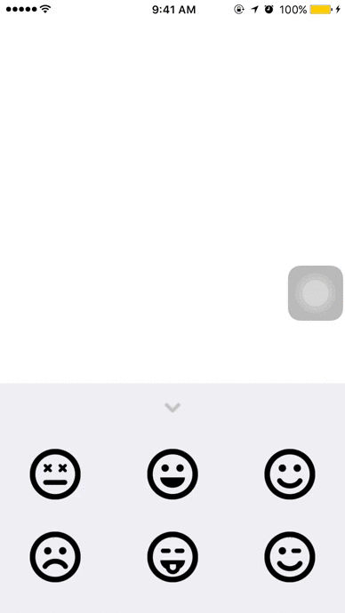

# Canvas

Canvas is an exercise to learn how to perform animations and gestures.

Time spent: 2 hours spent in total

## User Stories

The following **required** functionality is completed:

- [X] Add and Configure View Elements
- [X] Make the Tray Draggable
- [X] Tray Behavior
   - [X] Spring Animation (Optional)
- [X] Creating Faces
   - [X] When the new face is panned from the tray, scale it up a little (Optional)
   - [X] When the panning stops, scale it back down (Optional)
- [X] Panning Faces on the Canvas
- [X] The Tray Arrow

The following **optional** features are implemented:

- [ ] Scaling Faces
- [ ] Rotating Faces
- [ ] Dropping a Face on the Tray
- [ ] Deleting Faces
- [ ] Frictional Tray

## Video Walkthrough 

Here's a walkthrough of implemented user stories:

Walkthrough recorded by QuickTime Player.

## License

    Copyright 2017 Chi Hon Law

    Licensed under the Apache License, Version 2.0 (the "License");
    you may not use this file except in compliance with the License.
    You may obtain a copy of the License at

        http://www.apache.org/licenses/LICENSE-2.0

    Unless required by applicable law or agreed to in writing, software
    distributed under the License is distributed on an "AS IS" BASIS,
    WITHOUT WARRANTIES OR CONDITIONS OF ANY KIND, either express or implied.